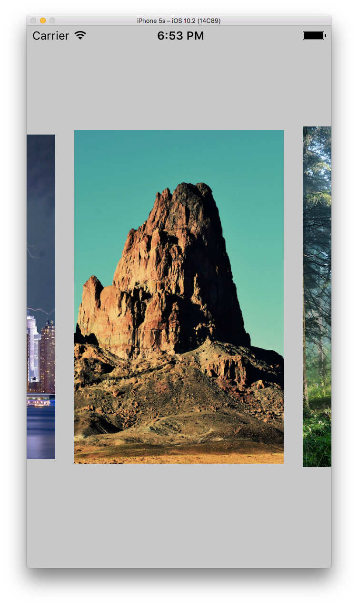

# glider
Let´s play around with UISnapBehavior and UIPanGestureRecognizer to build a picture gallery

I always wanted to create my own picture gallery where I can swype and select a picture from a set. I never used UISnapBehavior before so this was the perfect opportunity to play around with it in combination with UIDynamicAnimation.

